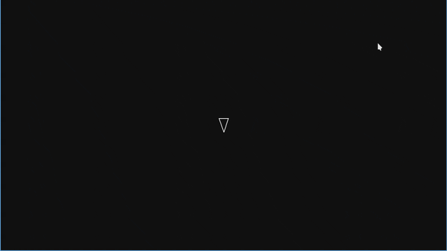

# Asteroids

Python version of the classic Asteroids arcade game. Pilot a ship, dodge
incoming asteroids, shoot them, and split larger rocks into smaller ones.

## Preview



## Features

- Player-controlled ship with rotation, forward/reverse movement, and shooting.
- Random asteroid spawning from the edges of the screen.
- Asteroids split into smaller asteroids when hit.
- Collision detection between the player, shots, and asteroids.
- JSONL runtime logs for game state and notable events.

## Requirements

- Python 3.13+
- [uv](https://docs.astral.sh/uv/) for dependency management

## Usage

Install dependencies:

```bash
uv sync
```

Run the game:

```bash
uv run python main.py
```

Controls:

- `Up Arrow`: move forward
- `Down Arrow`: move backward
- `Left Arrow`: rotate left
- `Right Arrow`: rotate right
- `Space`: shoot
